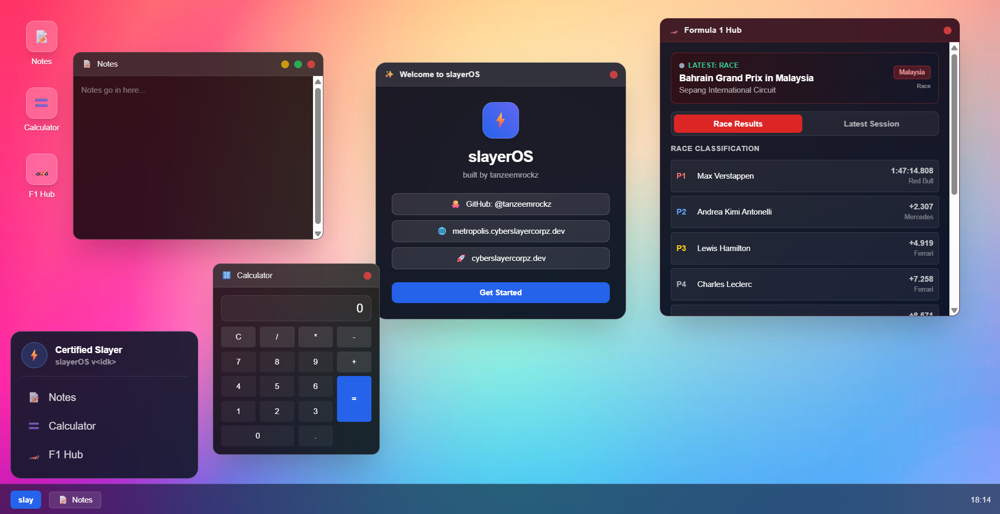

# slayerOS
My very own web based OS-like environment made for the Hack Club Stardance mission "web OS 1"

## Tech Stack
I used the following to build this app:
* HTML5
* ~~CSS~~
* JavaScript
* TailwindCSS (via CDN)
* OpenF1 API
* Jolpica Ergast F1 API
* Google Fonts CDN (for Google Sans)

## Features
slayerOS has the following features:
* A "slay" menu
* A taskbar
* An F1 hub app for viewing live Formula 1 results
* A calculator app
* A notes app that saves to localStorage
That's about it!

## Usage
You can check it by heading on to slayeros.cyberslyercorpz.dev (don't worry if it doesn't work, I will take time to deploy it you can just clone the repo/visit tanzeemrockz.github.io/slayerOS
